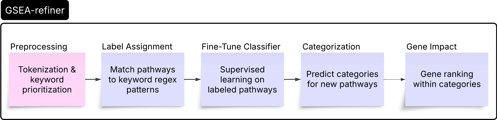

# gsea_refiner
 A python tool for transformer-based categorization and interpretation of pathway enrichment results.

## Overview
 Pathway enrichment analysis often returns thousands of significant gene sets with overlapping themes, making interpretation difficult. GSEA-refiner uses a fine-tuned transformer model (e.g., BioBERT) to assign biologically meaningful categories to enriched pathways. The tool also identifies top-ranked genes within each category and generates visualizations to summarize enrichment trends across transcriptomic datasets.
 
## Features
- Categorizes enriched pathways using a fine-tuned transformer model
- Predicts biological categories based on the semantic content
- Derives training data using rule-based keyword matching and enrichment scoring
- Ranks top genes within categories based on frequency significance
- Provides modular components for preprocessing, classification, visualization etc

## Workflow


## Documentation
See [gsea-refiner-doc.md](docs/methods.md) for technical details.

## Installation
Clone the repository and install:

### For development (editable mode)
```bash
git clone https://github.com/fesedebe/gsea_refiner.git
cd gsea_refiner
pip install -e .
```

## Dependencies
See `requirements.txt` for full list.
- `transformers`
- `datasets`
- `scikit-learn`
- `pandas`
- `torch`

